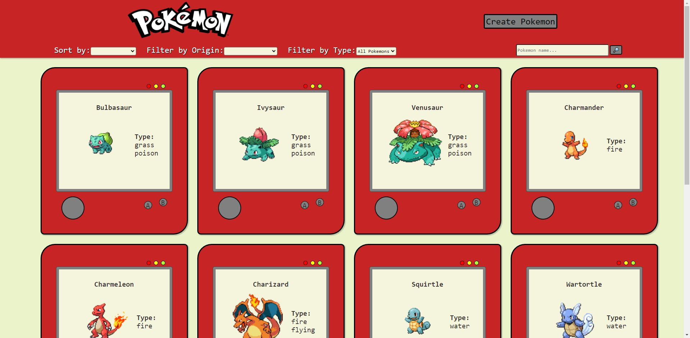

<h1 align='center'>PokeApp</h1>

  

<h2 align='center'>Single Page Application</h2>

  

##  Introduccion 
### Backend 

La aplicacion trae originalmente 40 pokemons de una api externa, toda esta informacion llega en bruto a mi backend en donde filtro solo por los datos que necesito para luego servirlos al front con 4 endpoints. 

### Database
Para crear los pokemons tengo dos modelos de base de datos: `pokemon` y `type` con una relacion de muchos a muchos.

### Frontend
La app esta realizada con css puro y reactjs. Esta cuenta con 4 rutas, en la principal se puede vizualizar una barra con filtros y busquedas, ademas de una lista de 12 pokemons. 

#### Funcionalidades de la app

- Visualizar a todos los pokemons en la pagina principal y poder recorrerlos con un paginado.
- Poder filtrarlos por ataque, puntos de vida y por tipos.
- Poder buscar un pokemon.
- Visualizar en una ruta diferente todas las propiedades de un pokemon.
- Tener la opcion de crear uno. 

Tecnologias Utilizadas
- Javascript
- Html
- Css
- ReactJs
- Redux
- Node
- Express
- Sequelize
- Postgresql
